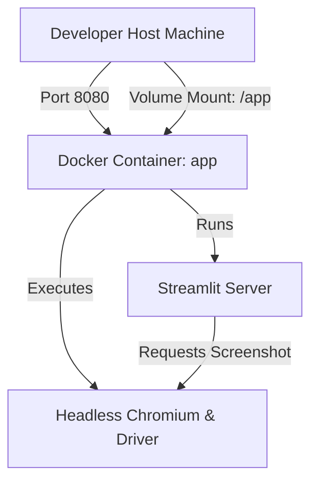

# Feature Specification: Dockerization for Local Development

## 1. Problem Statement
The Acorn DQM application requires multiple compiled, system-level dependencies (specifically GDAL/GEOS for `geopandas` and headless Google Chrome for map capture inside PDFs). Setting these up natively across different developer host platforms (e.g. Intel/Apple Silicon macOS, Windows, Linux) causes environment drift, driver mismatches, and deployment discrepancies. Additionally, our automated agent flows are most robust when executing commands through a standard container wrapper.

---

## 2. Goals & Scope
- **Goals**:
  - Provide a single-command local development environment boot (`docker compose up`).
  - Native hot-reloading: file modifications on the host must immediately reflect inside the container.
  - Headless PDF map capture out-of-the-box via containerized `chromium` and `chromium-driver` bindings.
  - Expose a simple bash command CLI wrapper (`./dc.sh`) for linting, testing, and operations.
  - Re-align `.agent/` rules and workflows back to standard Docker-based orchestrations.
- **Out of Scope**:
  - Production clustering (Kubernetes/Swarm configurations).
  - Multi-service database containers (the application parses static and remote data without a local SQL database).

---

## 3. Technical Architecture & Decisions

### 3.1 Docker Environment Configuration
We will construct a Docker build configuration using a Debian slim environment (`python:3.11-slim`) containing native libraries.



- **Base Image**: `python:3.11-slim` for standard and highly compatible Python wheel compiles.
- **Volume Mounts**: Direct local workspace mirror `.:/app` to allow instant hot-reloading.
- **Ports**: Expose and bind container port `8080` (as defined in `.streamlit/config.toml`) to host port `8080`.

---

## 4. Proposed File Specs

### 4.1 Dockerfile
```dockerfile
FROM python:3.11-slim

ENV PYTHONDONTWRITEBYTECODE=1 \
    PYTHONUNBUFFERED=1 \
    DEBIAN_FRONTEND=noninteractive

WORKDIR /app

RUN apt-get update && apt-get install -y --no-install-recommends \
    build-essential \
    curl \
    git \
    libgdal-dev \
    gdal-bin \
    chromium \
    chromium-driver \
    fonts-dejavu \
    && rm -rf /var/lib/apt/lists/*

COPY requirements.txt .
RUN pip install --no-cache-dir -r requirements.txt

COPY . .

EXPOSE 8080

CMD ["streamlit", "run", "app.py", "--server.port=8080", "--server.address=0.0.0.0"]
```

### 4.2 compose.yml
```yaml
name: acorn-dqm
services:
  app:
    build: .
    ports:
      - "8080:8080"
    volumes:
      - .:/app
    environment:
      - DEV_MODE=${DEV_MODE:-false}
    env_file:
      - .env
    restart: unless-stopped
```

### 4.3 CLI Wrapper (`dc.sh`)
Supports standard container interactions:
- `./dc.sh up` - Start container
- `./dc.sh down` - Tear down container
- `./dc.sh exec [cmd]` - Execute arbitrary commands (e.g. `./dc.sh exec app ruff check`)
- `./dc.sh ruff-check` - Run linting audits
- `./dc.sh test` - Execute pytest suite inside container

---

## 5. Acceptance Criteria

### 5.1 Environmental Parity
- [ ] Docker image builds successfully without package version compile issues on modern Docker engines.
- [ ] Container launches and streams logs perfectly.
- [ ] Application is accessible at `http://localhost:8080`.

### 5.2 Hot-Reloading & Operations
- [ ] Modifying local file triggers hot-reload within the running Streamlit container session.
- [ ] `./dc.sh` script is executable and operates all wrapper subcommands perfectly.
- [ ] Headless Chromium successfully processes PDF map screenshot captures (fallbacks operate robustly if Chromium has memory/display constraints).

### 5.3 Agent Flow Parity
- [ ] `.agent/rules/repo-structure.md` is re-aligned to enforce Docker workflows.
- [ ] `.agent/workflows/` (Implement, Integrate, Verify) use `./dc.sh` commands.
- [ ] Development and QA execution commands are fully containerized.
