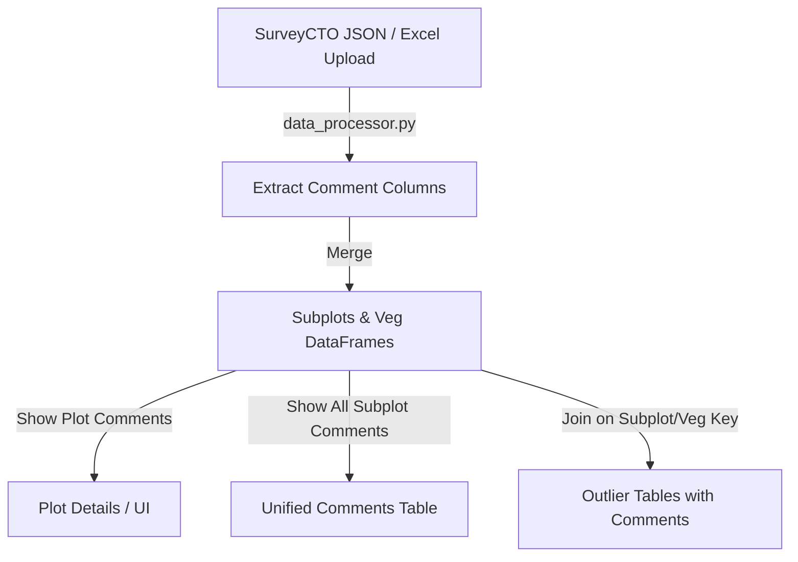

# Feature Specification: Enumerator Comments & Outlier Context Integration

## I. Overview & Goal
- **Problem Statement**: During field data collection, enumerators often record contextual comments (e.g., explaining why a subplot has unusual measurements due to steep slope, farmer absence, or rocky terrain). Currently, these comments are not exposed in the DQM tool. Data Quality Managers cannot easily determine if an outlier is a data entry error or a valid edge case, leading to unnecessary items in the clarification log.
- **Core Metric**: Reduce the number of false-positive items added to the clarification log by providing instant enumerator context alongside outlier tables.

---

## II. User Stories & Flows
- **User Persona**: Data Quality Manager / Validator.
- **User Journey**:
  1. The manager loads the Ground Truth (GT) data for a partner.
  2. In the **Plot Details** or **Subplot Details** pages, the manager views detected outliers (e.g., height outliers, circumference outliers).
  3. The manager sees a new `Enumerator Comment` column directly inside the outlier tables.
  4. The manager inspects the comment (e.g., "Farmer says tree was pruned heavily last month") and decides whether to flag the tree as an error or discard it as an explainable anomaly.
  5. The manager can also go to a dedicated comments view to scan all plot-level and subplot-level comments chronologically or filtered by enumerator.

---

## III. Requirements (Scope Guardrails)

### Must-Have
- **Data Processor updates**:
  - Automatically extract and merge all comment fields from SurveyCTO JSON payloads or Excel file uploads (scanning sheets/columns matching `*comment*`).
- **Plot-Level Comments**:
  - In the plot details view, display a table with: `Plot UUID / KEY`, `Enumerator Name`, `Submission Date`, and `Plot Comment`.
- **Unified Comments Table**:
  - Show a consolidated table of all other comments containing: `Subplot ID`, `Plot ID`, `Enumerator`, `Date`, `Comment Location` (e.g., vegetation section, measurements section), and the actual `Comment`.
- **Outlier Table Integration**:
  - Add an `Enumerator Comments` column to existing validation/outlier tables (e.g., height outliers, circumference outliers, suspicious circumference-by-age, etc.) where relevant comments exist for that subplot/tree.

### Nice-to-Have
- Search/filter capability in the unified comments table.
- Highlighting comments containing specific warning words (e.g., "slope", "pruned", "dead", "missing").

### Out of Scope
- Writing comment edits back to SurveyCTO.
- AI-based sentiment/text analysis of the comments.

---

## IV. Architecture & Data Flow

### Data Model Changes
- No database migrations are required since the application uses an in-memory/cached pandas DataFrame structure.
- Columns containing comments (e.g. `plot_comment`, `vegetation_comment`, `comment_plot`, etc.) will be dynamically extracted from the raw sheets (`plots`, `subplots`, `vegetation`) during the `merge_all_data()` step in `utils/data_processor.py`.

---

## V. Acceptance Criteria

### User Acceptance Criteria (UAC)
- **UAC 1**: In the plot issues/details page, a table must display all plot-level comments, along with the Plot UUID, enumerator, and submission date.
- **UAC 2**: A unified comments table must show all other comments, including the exact source location (e.g., vegetation, tree measurements) of each comment.
- **UAC 3**: In the vegetation validation and outlier tables (e.g. height outliers), there must be a column showing comments associated with that subplot/tree.

### Technical Acceptance Criteria (TAC)
- The comment extraction logic must handle missing comment columns gracefully (i.e. not crash if a partner's form has no comments).
- The regex scanning for comment columns must be case-insensitive and support both SurveyCTO JSON keys and Excel sheet headers.

---

## VI. Edge Cases & Errors
- **Empty States**: If no comments are found in the imported dataset, show a friendly info message: `"No enumerator comments found in this dataset."`
- **Missing Columns**: If a partner form does not define comment fields, the tables should simply show empty or not display the columns, without crashing.
- **Very Long Comments**: Comments should wrap cleanly in Streamlit tables rather than overflowing or getting truncated.

---

## VII. Epic & Ballpark Estimation

### Component Breakdown
1. **Research & Column Discovery**: Download/inspect raw SurveyCTO forms to map all variations of comment field names. (Medium, ~0.5 day)
2. **Data Pipeline Updates (`utils/data_processor.py`)**: Extract comment fields, clean them, and map them to subplots and vegetation tables. (Medium, ~1 day)
3. **UI Updates (`pages/` and `ui/`)**:
   - Integrate comments into Plot Details/Issues page. (Simple, ~0.5 day)
   - Build the Unified Comments Table view. (Simple, ~0.5 day)
   - Add comments columns to all outlier tables in Subplot Details. (Medium, ~1 day)
4. **QA & Verification**: Verify lookups across various partners (e.g., COMACO, SOLK) using sample data files. (Simple, ~0.5 day)

**Total Estimate**: ~3.5 Developer Days (Story Points: 5)
