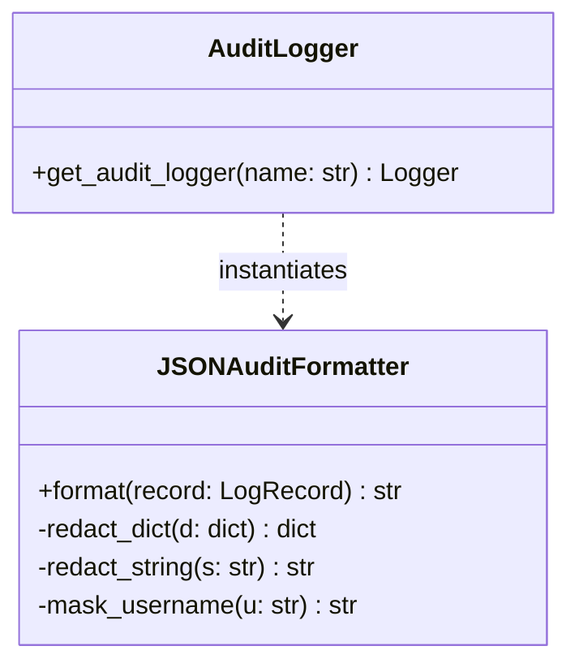
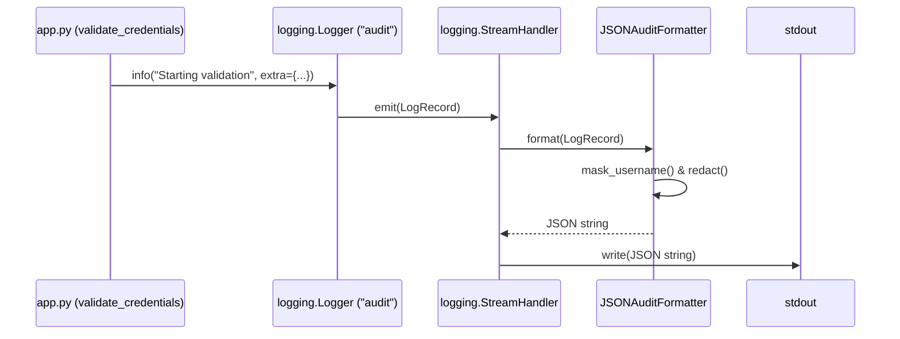

# LLD — Structured Security Audit Logging with PII Redaction

> **Stage 3 of 3 — Documentation Hierarchy**
> Owner: Winston (Architect) | Target Location: `docs/lld/security_review_logging_lld.md` | References: `docs/prd/security_review_logging_prd.md`
> Status: `Draft` | Design Review: _[Approved]_

---

## 1. Overview & Scope

**Component / Module**:
`utils.logging_utils` + `JSONAuditFormatter` & `app.py` (`validate_credentials`).

**PRD References**:
FR-001, FR-002, FR-003, FR-004

**Out of Scope for this LLD**:
- Modifying standard `Streamlit` dashboard output formatting (remains standard Streamlit stream).
- Creating external file-based log rotation or shipping systems.

**SOLID Compliance Commitment**:
- **Single Responsibility Principle (SRP)**: `JSONAuditFormatter` handles only JSON formatting and PII/credential redaction.
- **Dependency Inversion Principle (DIP)**: `validate_credentials` uses the Python standard `logging` library abstract interface, decoupled from the specific log formatter implementation.

---

## 2. Component & Class Design



### Class Responsibilities:
| Class | Responsibility | SOLID Principle |
|-------|---------------|-----------------|
| `JSONAuditFormatter` | Subclasses standard `logging.Formatter`. Processes `LogRecord` fields and serializes them into redacted JSON strings. | SRP |
| `AuditLogger` | Configures and registers standard Streamlit/stdout logging handler with `JSONAuditFormatter` attached. | SRP |

---

## 3. Data Flow & Sequence Diagrams

### 3.1 Credential Validation Logic Flow



---

## 4. API & Logger Contract

### Logger Call Interface

When logging authentication events inside `app.py`:

```python
logger = get_audit_logger("audit")

# Log initialization
logger.info(
    "[validate_credentials] Starting validation...",
    extra={
        "url": url,
        "username": username,
        "action": "auth_started"
    }
)
```

### Log JSON Output Schema

```json
{
  "timestamp": "2026-05-28T22:30:03.123Z",
  "level": "INFO",
  "name": "audit",
  "message": "[validate_credentials] Starting validation...",
  "url": "https://akvofoundation.surveycto.com/api/v2/forms/data/wide/json/form_id",
  "username": "adm***",
  "action": "auth_started",
  "response_status": 200,
  "response_length": 1420
}
```

---

## 5. Logic & Algorithms

### Username Masking Logic
```python
def mask_username(username: str) -> str:
    if not username:
        return "(empty)"
    username = str(username).strip()
    if len(username) < 3:
        return "***"
    return f"{username[:3]}***"
```

### Key Redaction / Sanitization Algorithm
Iterate recursively over dictionaries or apply string replacement checks for keys containing: `password`, `auth`, `token`, `secret`, `key`.
If a value is identified as sensitive, replace its contents with `[REDACTED]`.

---

## 6. Error Handling & Edge Cases

| Scenario | Detection | Response | Fallback |
|----------|-----------|----------|----------|
| Non-JSON serializable extra fields | `json.dumps()` raises `TypeError` | Log warning with serialization failure details | Format using safe fallback `str(record)` or drop faulty fields |
| Extremely long response body | `response.text` length exceeds buffer | Cap log payload at 200 chars and redact all variables | Print truncated message with string length |
| Exception occurred | `requests.exceptions` raised | Format exception info in `"exception"` key | Output safe standard traceback string |

---

## Exit Criterion

> [!IMPORTANT]
> This LLD must be signed off by the Tech Lead before task implementation begins.
