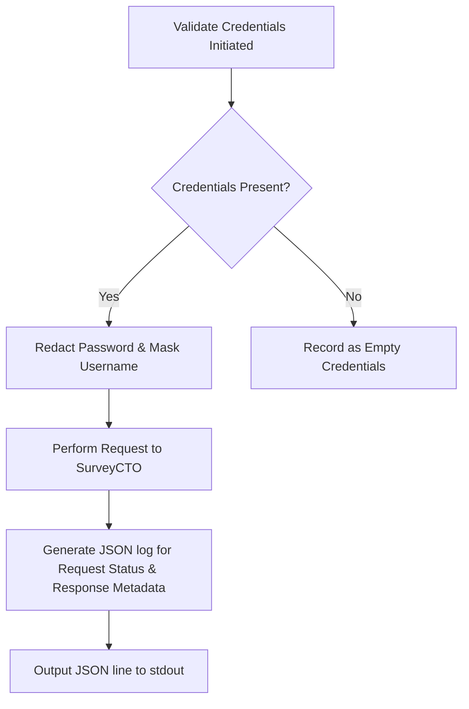

# PRD — Structured Audit Event Logging with PII-Aware Redaction

> **Stage 2 of 3 — Documentation Hierarchy**
> Owner: Winston (Architect) + Sally (UX) | Target Location: `docs/prd/security_review_logging_prd.md`
> Status: `Draft` | Sign-off: Engineering Lead: _[Pending]_

---

## 1. Overview

**One-liner**:
Implement structured JSON audit-event logging with PII/credential redaction in the credential validation flow, replacing plaintext `print()` statements.

**Brief / Problem Reference**:
Remediation of security review findings regarding credential validation logging.

**What we are building** (What):
A structured logging mechanism using Python's standard `logging` library configured to produce JSON format log events. It will redact sensitive information (such as password parameters, raw tokens, or response body secrets) before writing to stdout. All raw `print()` statements in `validate_credentials` inside `app.py` will be replaced with structured logs.

**Why now** (Strategic context):
Standardizing diagnostic logging avoids credentials/PII exposure in stdout and allows automated alerting/ingestion systems (e.g. Datadog, ELK) to parse logs and trigger alerts on authentication failures or high-frequency anomalies.

---

## 2. Goals & Success Metrics

| Goal | Success Metric | Baseline | Target | Owner |
|------|---------------|----------|--------|-------|
| Prevent credential/PII leakage | Zero passwords, complete auth headers, or raw response credentials printed | Exposed via raw prints | Complete redaction of secret parameters | Dev |
| Enable automated alerting | All validation attempts logged in valid structured JSON format | Plaintext `print()` | 100% of auth logs are parsed JSON | Dev |
| Diagnostics usability | Developers can trace failures without seeing user passwords | Hard to trace safely | Safe tracing with partial username & redacted credentials | Dev |

**Anti-Goals** (what we will NOT optimize for):
- We are not building a fully fledged centralized logging dashboard inside Streamlit itself.
- We are not changing the authentication protocol of SurveyCTO.

---

## 3. Target Users & Personas

| Persona | Job-to-be-Done | Key Frustration | v1 Priority |
|---------|---------------|-----------------|-------------|
| Security Auditor / System Admin | Monitor auth attempts and verify credentials aren't leaked in logs | Plaintext logs contain credentials/PII and cannot be parsed programmatically | Primary |
| Developer | Troubleshoot credentials validation issues safely | Raw prints expose passwords or fail to show error structures cleanly | Secondary |

---

## 4. User Stories

| ID | User Story | Priority (MoSCoW) | FR Reference |
|----|-----------|-------------------|--------------|
| US-001 | As a **Security Auditor**, I want all auth validation attempts logged in structured JSON so that ingestion engines can trigger alerts. | Must Have | FR-001 |
| US-002 | As a **System Admin**, I want any sensitive values (like passwords, keys, or raw payloads) in the logs redacted so that credentials are never leaked. | Must Have | FR-002, FR-003 |

---

## 5. Functional Requirements

| ID | Requirement | User Story | Priority |
|----|-------------|------------|----------|
| FR-001 | The system MUST write credential validation events to standard output in structured JSON format. | US-001 | Must Have |
| FR-002 | The logging system MUST redact user credentials (passwords, complete authentication headers) and sensitive data patterns. | US-002 | Must Have |
| FR-003 | The logging system MUST only log the first 3 characters of the username followed by masking (e.g., `adm***`) for PII protection. | US-002 | Must Have |
| FR-004 | The system MUST replace stdout `print()` statements in `validate_credentials` with logger calls. | US-001 | Must Have |

---

## 6. Non-Functional Requirements

| Category | Requirement | Metric |
|----------|-------------|--------|
| **Security** | Zero raw credentials printed to stdout/stderr | 100% redaction compliance |
| **Performance** | Logging overhead must not block the API request | < 5ms logging execution latency |
| **Format** | JSON output must be valid single-line JSON records | Standard JSON parser compliant |

---

## 7. User Flows & Wireframes

### Primary Flow (JSON Log Event Structure)

---

## 8. Scope

**v1 — In Scope**:
- Replaced printing in `validate_credentials` (`app.py`).
- JSON Formatter class for Python logging to structure audit logs.
- Redaction function to filter dictionary/string values containing passwords or tokens.

**v1 — Explicitly Out of Scope**:
- Adding remote log forwarding (e.g., direct Syslog or Datadog API integrations).
- Restructuring all geometry validation diagnostics `logging.getLogger('dqm')` unless needed to prevent output conflicts.

---

## 9. Acceptance Criteria

### User Acceptance Criteria (UAC)
- **UAC-001**: Given a user tries to validate SurveyCTO credentials, when the process runs, then no credentials or raw response bodies are visible in standard output logs.
- **UAC-002**: Given a system administrator inspects container stdout, when an authentication event occurs, then they see a structured JSON object containing event details with sensitive items redacted.

### Technical Acceptance Criteria (TAC)
- **TAC-001**: Outputted JSON log lines must parse successfully as JSON objects.
- **TAC-002**: Standard username formatting must display exactly the first 3 characters followed by `***` (or `(empty)` if empty).
- **TAC-003**: The first 200 bytes of the response body must be checked for JSON/XML payload structures and sanitized of potential sensitive/PII data.

---

## 10. Edge Cases & Errors

### Failures
- **SurveyCTO Timeout**: If the API call times out, the JSON log must include the exception type and details, while keeping credentials redacted.
- **Invalid Server Name**: Logging must handle missing/malformed server names gracefully.

### Empty States
- **No credentials input**: Log records username as `(empty)` and password status as `Not Provided`.

### Boundary Conditions
- **Short Usernames**: Usernames shorter than 3 characters must be fully masked as `***` or masked as much as possible to avoid leakages.

---

## 11. Analytics & Telemetry

### Tracking Events
- **Auth validation attempts**: Event type, status (Success/Failure), error code (if failed), and response length.

---

## 12. Rollout & Rollback Plan

### Rollout Strategy
- Verify locally and on dev environment logs.
- Deploy to main workspace; the application container picks up standard output logs immediately.

### Rollback Plan
- Revert commit if logging format disrupts third-party tools or logs fail to parse.

---

## 13. Epic & Ballpark Estimation

### Component Breakdown
- **Utility Implementation** (`utils/logging_utils.py`): Simple/Medium - 0.5 Day.
- **Application Logic Adaptation** (`app.py`): Simple - 0.5 Day.
- **Verification Script** (`verify_logging.py`): Simple - 0.5 Day.

**Ballpark Estimate**: 1.5 Days
**Assumptions**: Standard Python logging handles JSON format output cleanly, and there are no external logging libraries to configure.

---

## 14. Change Log

| Version | Date | Author | Changes |
|---------|------|--------|---------|
| 0.1 | 2026-05-28 | Winston | Initial draft for security audit event logging |
| 0.2 | 2026-05-28 | Winston | Added standard sections including UAC/TAC and estimations |

---

## Exit Criterion

> [!IMPORTANT]
> This PRD MUST be signed off by the Engineering Lead before LLD begins. No tickets may be created until this is complete.
