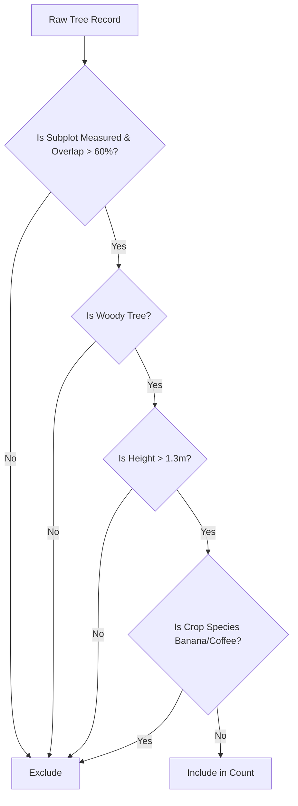

# Feature Specification: Tree Count Discrepancy & Protocol Alignment

This specification outlines the business requirements, protocol alignment rules, and technical implementation plan to resolve the tree count discrepancy between the Ground Truth (GT) and Data Quality (DQ) dashboards.

---

## 1. Executive Summary & Problem Statement

There is a mismatch between the tree counts displayed on the Streamlit comparison dashboard and the partner's verified sheets (e.g., `DQ_VS_GT_FARM_AFRICA.xlsx`, `dq_vs_gtSolKenya.xlsx`).

The mismatch is caused by a **two-fold discrepancy** between the live Streamlit codebase and the Rabobank ACORN verification protocol:

### 🔴 Flaw A: The Ignored Subplot & Spatial Overlap Filter
In the dashboard's user interface (`pages/_Z_GT_DQ_Comparison.py`), the app successfully generates a list of measured subplots that pass the spatial overlap check. However:
1. **Ignored in Summaries**: When the UI passes this filtered list (`gdf`) to `get_tree_count_by_name` in `utils/comparison_utils.py`, the helper function completely ignores the parameter, counting trees in unmeasured subplots (e.g., Subplot 5) and subplots with poor spatial overlap.
2. **Missing in Details**: When rendering individual species records, the UI fails to pass this filtered list to `get_tree_records_by_species`, causing detail cards to display unqualified trees.

### 🔴 Flaw B: Missing Tree Height & Crop Species Protocols
The current Streamlit application counts every single tree record present in the vegetation sheet. However, Indira's carbon protocol strictly dictates:
1. **Tree Height Filter**: ONLY include trees **above 1.3 meters** (excluding young seedlings and weeds).
2. **Crop Species Exclusions**: Exclude non-forest agricultural species that do not qualify under the carbon protocol:
   * **Bananas**: `musa_sp`, `ensete_ventricosum`, `musa_paradisiaca`, `musa_acuminata`
   * **Coffee**: `coffea_arabica`, `coffea_canephora`

---

## 2. Protocol Validation Rules (Plain Language)

To achieve 100% mathematical parity with Indira's verification sheets, a tree record must pass all of the following gates:



1. **Measured Subplots & Overlap Gate**: The subplot key (e.g. `uuid:xxx/sub_plot[3]`) must be present in the list of subplots that are officially measured (subplot number $\le$ `measured_subplots`) and have **>60% spatial overlap** with their Ground Truth counterpart.
2. **Woody Species Gate**: The `non_woody_species` column must be null/empty.
3. **Tree Height Gate**: The tree's measured height in the measurements sheet must be strictly **greater than 1.3m**.
4. **Crop Species Gate**: The tree species name must NOT match any of the coffee or banana species listed in Section 1.

---

## 3. Technical Code Locations

Here are the specific lines in the Streamlit application that require modification:

### 📍 Location 1: `utils/comparison_utils.py` (Summary Counts)
In [utils/comparison_utils.py](../utils/comparison_utils.py#L277-L345), the `gdf` parameter is accepted but never used to filter vegetation rows:
```python
def get_tree_count_by_name(plot_key: str, raw_data: Dict, gdf: gpd.GeoDataFrame = None) -> Dict[str, int]:
    # ...
    # Filter to this plot's subplots (Currently ignores the passed gdf!)
    plot_veg = veg_df[veg_df["SUBPLOT_KEY"].str.startswith(plot_key + "/", na=False)].copy()
```

### 📍 Location 2: `utils/comparison_utils.py` (Detail Records)
In [utils/comparison_utils.py](../utils/comparison_utils.py#L348-L380), the function signature does not accept the `gdf` filter, making it impossible for detailed species tables to filter by measured/overlapping subplots:
```python
# Currently missing gdf parameter
def get_tree_records_by_species(plot_key: str, species_name: str, raw_data: Dict) -> pd.DataFrame:
```

### 📍 Location 3: `pages/_Z_GT_DQ_Comparison.py` (Page Details Dispatch)
In [pages/_Z_GT_DQ_Comparison.py](../pages/_Z_GT_DQ_Comparison.py#L1012-L1019), the UI dispatches detailed record loading without passing the measured subplot filters:
```python
gt_records = get_tree_records_by_species(gt_key, sp, gt_raw)
dq_records = get_tree_records_by_species(dq_key, sp, dq_raw)
```

---

## 4. Technical Remediation Plan

We will implement the following updates across the files to establish full alignment:

### Step A: Subplot Filtering Injection
Update both `get_tree_count_by_name` and `get_tree_records_by_species` inside `utils/comparison_utils.py` to filter vegetation records using the valid `SUBPLOT_KEY`s from `gdf` when provided:
```python
if gdf is not None and "SUBPLOT_KEY" in gdf.columns:
    valid_subplot_keys = gdf["SUBPLOT_KEY"].dropna().unique()
    plot_veg = plot_veg[plot_veg["SUBPLOT_KEY"].isin(valid_subplot_keys)]
```

### Step B: Height & Species Exclusions Injection
To adhere to the Open-Closed Principle, we will define the height threshold and excluded species as module-level constants rather than hardcoding them inside the functions:

```python
# Defined at the top of utils/comparison_utils.py (or config.py)
MIN_TREE_HEIGHT_M = 1.3
EXCLUDED_CROP_SPECIES = [
    "musa_sp", "ensete_ventricosum", "musa_paradisiaca", "musa_acuminata",
    "coffea_arabica", "coffea_canephora"
]
```

We will then apply the filtering in the functions as follows:
1. **Load Heights**: Inside both functions, merge `plots_subplots_vegetation` records with the `plots_subplots_vegetation_measurements` sheet/dataframe using `VEGETATION_KEY` to retrieve `tree_height_m`.
2. **Apply Filters**:
   ```python
   # Exclude trees under the height threshold
   if "tree_height_m" in plot_veg.columns:
       plot_veg = plot_veg[plot_veg["tree_height_m"].isna() | (plot_veg["tree_height_m"] > MIN_TREE_HEIGHT_M)]

   # Exclude non-forest crops (Bananas and Coffee) using the constant list
   plot_veg = plot_veg[~plot_veg["woody_species"].isin(EXCLUDED_CROP_SPECIES)]
   ```

### Step C: UI Dispatch Synchronization
Update `pages/_Z_GT_DQ_Comparison.py` (lines 1012 and 1019) to pass `gt_measured` and `dq_measured` into the updated detailed species function:
```python
gt_records = get_tree_records_by_species(gt_key, sp, gt_raw, gt_measured)
dq_records = get_tree_records_by_species(dq_key, sp, dq_raw, dq_measured)
```

---

## 5. Backlog Coordination & Verification
This specification represents the formal contract for the implementation phase. Development will proceed as follows:
1. **Sprint Planning**: Draft a Scrum backlog and stories under `agent_docs/stories/`.
2. **TDD Implementation**: Execute development under the TDD workflow, writing tests for each filter rule before making functional changes.
